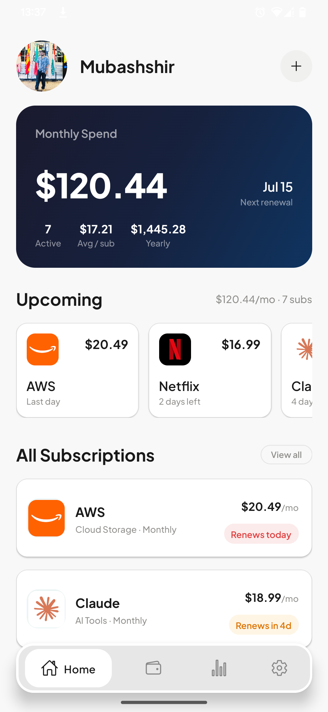
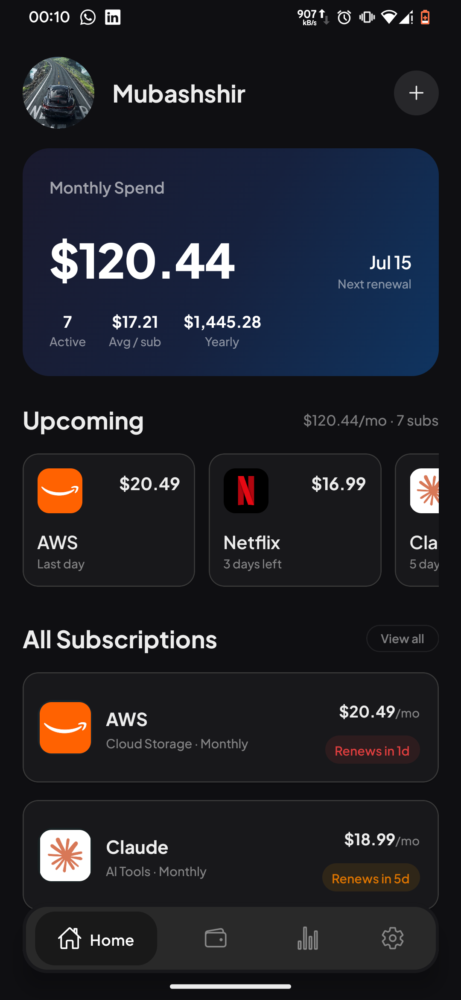
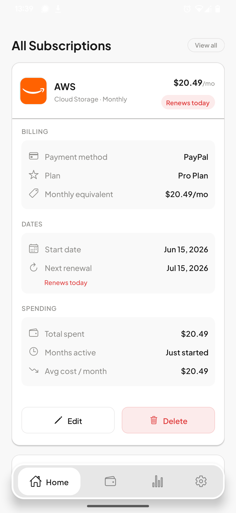
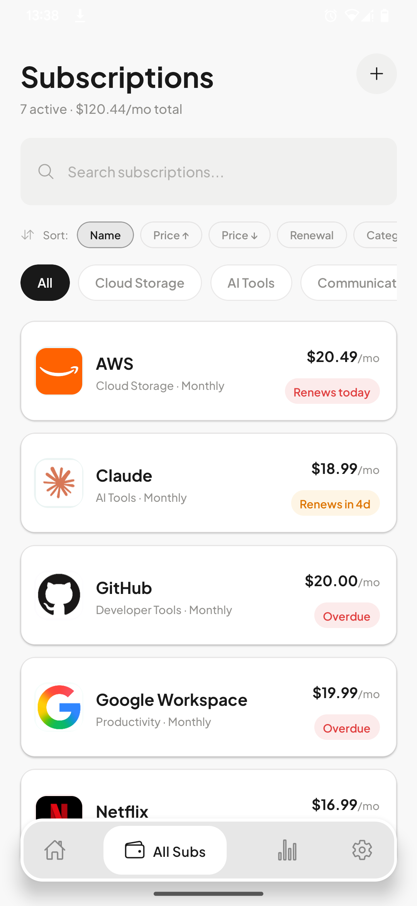
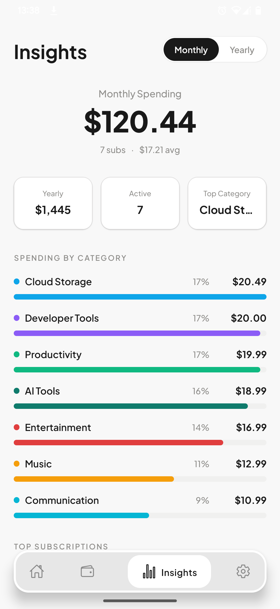
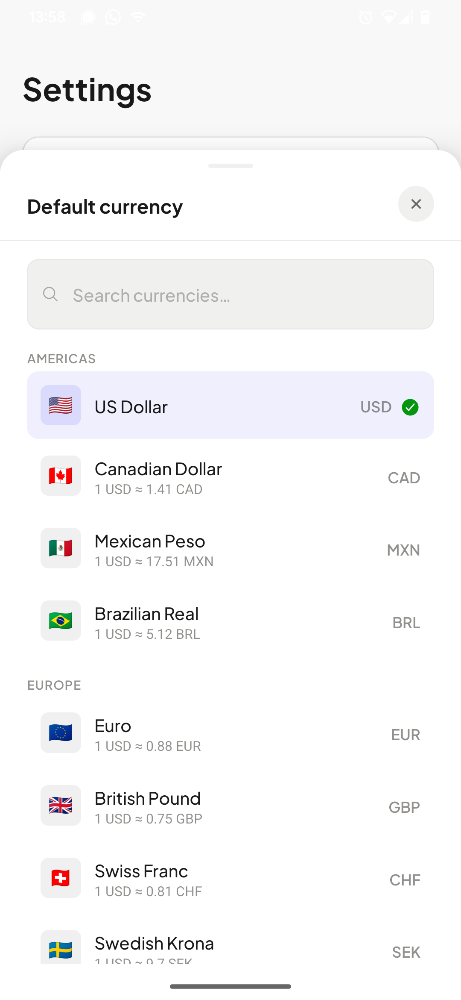
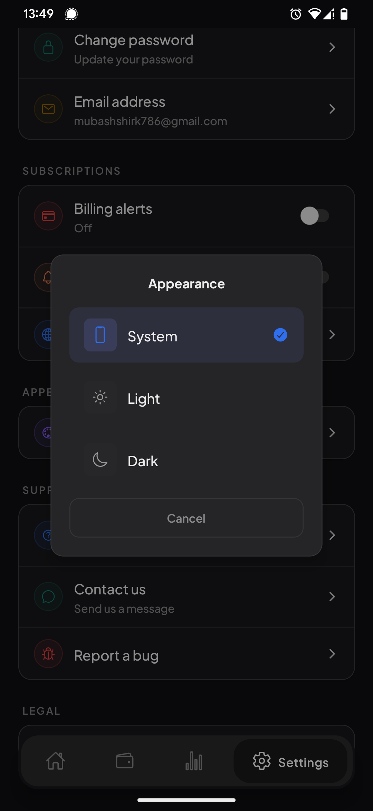
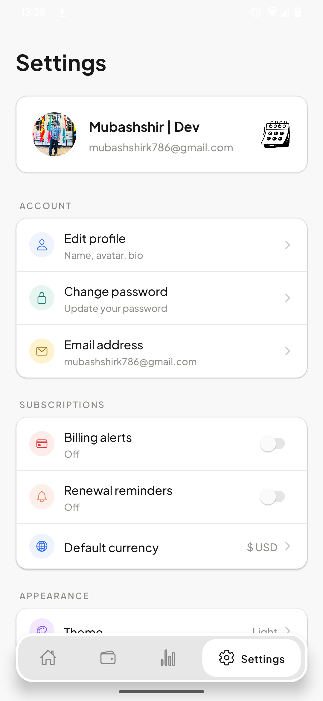

<div align="center">

# SubRadar

**Never lose track of your subscriptions again.**

A sleek subscription tracking app that helps you visualize recurring spending, get renewal reminders, and make smarter financial decisions.

[](https://reactnative.dev)
[](https://expo.dev)
[](https://www.typescriptlang.org)
[](#license)

</div>

---

## Preview

<div align="center">
  
  
  
  
</div>

<div align="center">
  
  
  
  
</div>

---

## Features

### Subscription Management
- Add, edit, and delete subscriptions with full details
- Auto-fetch logos for 60+ popular services (Netflix, Spotify, ChatGPT, GitHub, and more)
- Search, filter by category, and sort by name, price, renewal date, or category

### Spending Insights
- Monthly and yearly spending totals with animated counters
- Category breakdown with visual bar charts
- Top subscriptions ranked by cost
- AI-generated smart insights on your spending patterns

### Renewal Reminders
- Upcoming renewals carousel for the next 7 days
- Configurable billing alerts and renewal reminders via push notifications

### Multi-Currency Support
- 15 currencies: USD, CAD, MXN, BRL, EUR, GBP, CHF, SEK, INR, CNY, JPY, KRW, SGD, AUD, AED
- Real-time exchange rates with 24-hour local caching

### Secure Authentication
- Sign up / sign in with email or OAuth social login
- Secure cloud sync via Supabase with Row Level Security

### Theme & Polish
- Dark mode, Light mode, and System theme
- Skeleton loaders, pull-to-refresh, offline banner, toast notifications
- Error boundaries and confirmation dialogs for destructive actions

---

## Tech Stack

| Layer | Technology |
|---|---|
| Framework | Expo SDK 54, React Native 0.81.5, Expo Router 6 |
| Language | TypeScript 5.9 |
| Styling | NativeWind 5 (Tailwind CSS), Plus Jakarta Sans |
| State | Zustand |
| Data Fetching | TanStack React Query v5 with offline persistence |
| Authentication | Clerk |
| Database | Supabase with Row Level Security |
| Notifications | expo-notifications |
| Animations | react-native-reanimated 4 |

---

## Getting Started

### Prerequisites

- [Node.js](https://nodejs.org/) 18+
- [Expo CLI](https://docs.expo.dev/get-started/installation/)
- A [Clerk](https://clerk.com) account (for authentication)
- A [Supabase](https://supabase.com) project (for the database)

### Installation

```bash
# Clone the repository
git clone https://github.com/MubashshirK/SubRadar.git
cd SubRadar

# Install dependencies
npm install
```

### Environment Variables

Create a `.env` file in the root directory:

```env
EXPO_PUBLIC_CLERK_PUBLISHABLE_KEY=your_clerk_publishable_key
EXPO_PUBLIC_SUPABASE_URL=your_supabase_url
EXPO_PUBLIC_SUPABASE_ANON_KEY=your_supabase_anon_key
```

See `.env.example` for the full list of required variables.

### Run the App

```bash
npx expo start
```

Scan the QR code with Expo Go (Android/iOS) or run on a simulator.

---

## Project Structure

```
SubRadar/
├── app/                # Expo Router screens (file-based routing)
├── assets/             # Fonts, images, icons
├── components/         # Reusable UI components
├── constants/          # Theme colors, config values
├── hooks/              # Custom React hooks
├── lib/                # Supabase client, utilities
├── preview/            # App screenshots
└── store/              # Zustand stores
```

---

## Author

**Mubashshir Khan**
[GitHub](https://github.com/MubashshirK)

---

## License

This project is licensed under the MIT License.
